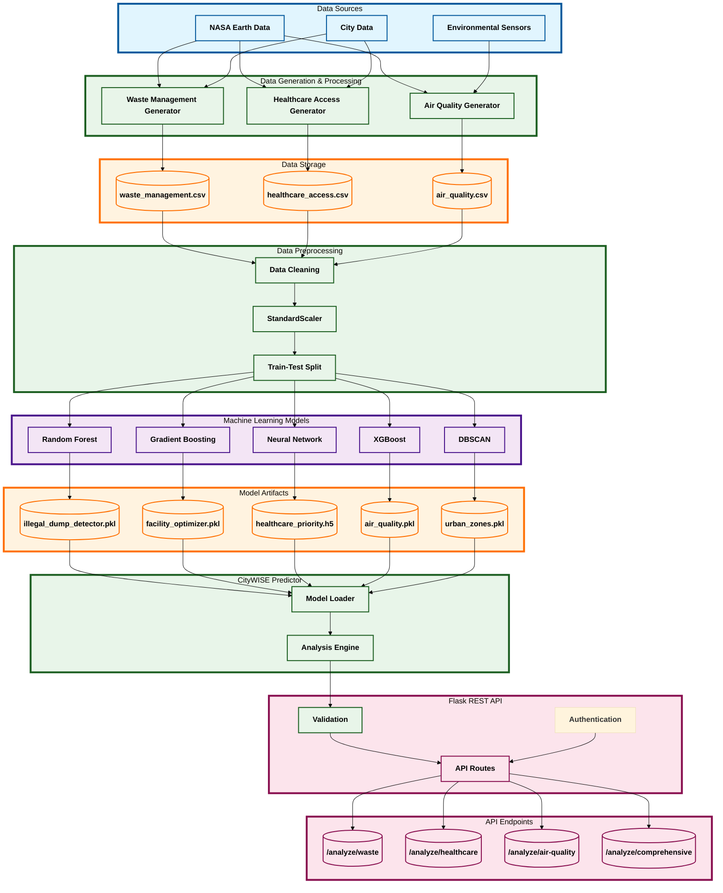

```mermaid
%%{init: {'theme': 'base', 'themeVariables': { 'fontSize': '16px', 'fontWeight': 'bold', 'textColor': '#000000' }}}%%
flowchart TD
    subgraph DataSources[Data Sources]
        NASA[<strong>NASA Earth Data</strong>]
        City[<strong>City Data</strong>]
        Sensors[<strong>Environmental Sensors</strong>]
    end

    subgraph DataGen[Data Generation & Processing]
        WM[<strong>Waste Management Generator</strong>]
        HC[<strong>Healthcare Access Generator</strong>]
        AQ[<strong>Air Quality Generator</strong>]
        
        NASA --> WM
        NASA --> HC
        NASA --> AQ
        City --> WM
        City --> HC
        Sensors --> AQ
    end

    subgraph Storage[Data Storage]
        WMD[(<strong>waste_management.csv</strong>)]
        HCD[(<strong>healthcare_access.csv</strong>)]
        AQD[(<strong>air_quality.csv</strong>)]
        
        WM --> WMD
        HC --> HCD
        AQ --> AQD
    end

    subgraph PreProcess[Data Preprocessing]
        Scale[<strong>StandardScaler</strong>]
        Split[<strong>Train-Test Split</strong>]
        Clean[<strong>Data Cleaning</strong>]
        
        WMD & HCD & AQD --> Clean
        Clean --> Scale
        Scale --> Split
    end

    subgraph Models[Machine Learning Models]
        direction TB
        RF[<strong>Random Forest</strong>]
        GB[<strong>Gradient Boosting</strong>]
        NN[<strong>Neural Network</strong>]
        XGB[<strong>XGBoost</strong>]
        DB[<strong>DBSCAN</strong>]
        
        Split --> RF & GB & NN & XGB & DB
    end

    subgraph Artifacts[Model Artifacts]
        PKL1[(<strong>illegal_dump_detector.pkl</strong>)]
        PKL2[(<strong>facility_optimizer.pkl</strong>)]
        H5[(<strong>healthcare_priority.h5</strong>)]
        PKL3[(<strong>air_quality.pkl</strong>)]
        PKL4[(<strong>urban_zones.pkl</strong>)]
        
        RF --> PKL1
        GB --> PKL2
        NN --> H5
        XGB --> PKL3
        DB --> PKL4
    end

    subgraph Predictor[CityWISE Predictor]
        Load[<strong>Model Loader</strong>]
        Analyze[<strong>Analysis Engine</strong>]
        
        PKL1 & PKL2 & H5 & PKL3 & PKL4 --> Load
        Load --> Analyze
    end

    subgraph API[Flask REST API]
        Routes[<strong>API Routes</strong>]
        Auth[<strong>Authentication</strong>]
        Valid[<strong>Validation</strong>]
        
        Analyze --> Valid
        Valid --> Routes
        Auth --> Routes
    end

    subgraph Endpoints[API Endpoints]
        W[(<strong>/analyze/waste</strong>)]
        H[(<strong>/analyze/healthcare</strong>)]
        A[(<strong>/analyze/air-quality</strong>)]
        U[(<strong>/analyze/comprehensive</strong>)]
        
        Routes --> W & H & A & U
    end

    classDef source fill:#e1f5fe,stroke:#01579b,stroke-width:2px,color:#000000
    classDef storage fill:#fff3e0,stroke:#ff6f00,stroke-width:2px,color:#000000
    classDef process fill:#e8f5e9,stroke:#1b5e20,stroke-width:2px,color:#000000
    classDef model fill:#f3e5f5,stroke:#4a148c,stroke-width:2px,color:#000000
    classDef api fill:#fce4ec,stroke:#880e4f,stroke-width:2px,color:#000000

    class NASA,City,Sensors source
    class WMD,HCD,AQD,PKL1,PKL2,H5,PKL3,PKL4 storage
    class WM,HC,AQ,Scale,Split,Clean,Load,Analyze,Valid process
    class RF,GB,NN,XGB,DB model
    class Routes,W,H,A,U api

    %% Styling subgraphs
    style DataSources fill:#e1f5fe,stroke:#01579b,stroke-width:4px
    style DataGen fill:#e8f5e9,stroke:#1b5e20,stroke-width:4px
    style Storage fill:#fff3e0,stroke:#ff6f00,stroke-width:4px
    style PreProcess fill:#e8f5e9,stroke:#1b5e20,stroke-width:4px
    style Models fill:#f3e5f5,stroke:#4a148c,stroke-width:4px
    style Artifacts fill:#fff3e0,stroke:#ff6f00,stroke-width:4px
    style Predictor fill:#e8f5e9,stroke:#1b5e20,stroke-width:4px
    style API fill:#fce4ec,stroke:#880e4f,stroke-width:4px
    style Endpoints fill:#fce4ec,stroke:#880e4f,stroke-width:4px
```