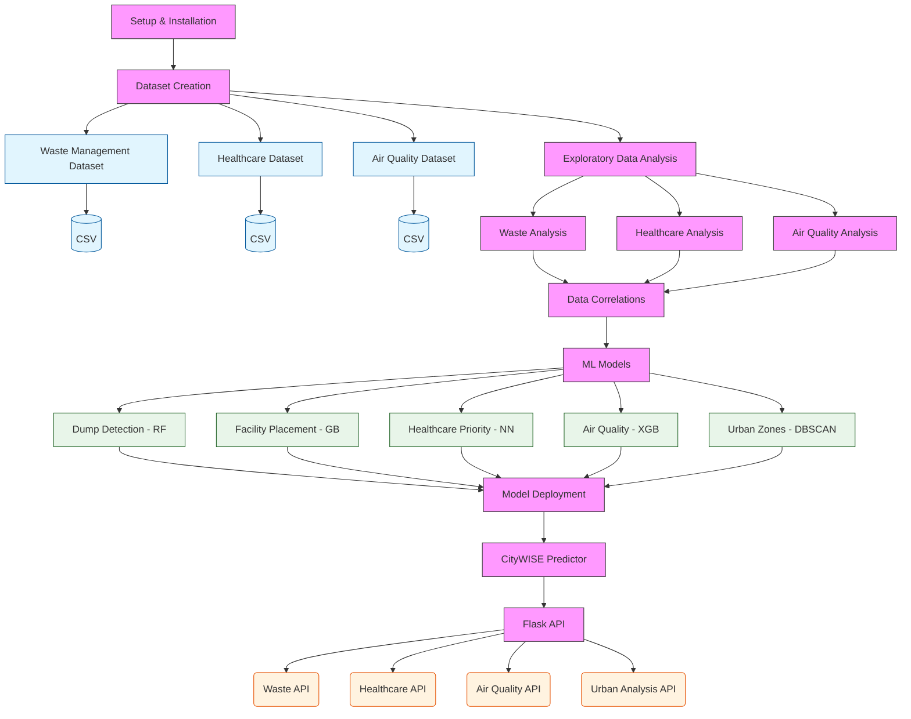

```mermaid
flowchart TD
    A[Setup & Installation] --> B[Dataset Creation]
    
    B --> B1[Waste Management Dataset]
    B --> B2[Healthcare Dataset]
    B --> B3[Air Quality Dataset]
    B1 --> CSV1[(CSV)]
    B2 --> CSV2[(CSV)]
    B3 --> CSV3[(CSV)]

    B --> C[Exploratory Data Analysis]
    C --> C1[Waste Analysis]
    C --> C2[Healthcare Analysis]
    C --> C3[Air Quality Analysis]
    C1 & C2 & C3 --> D[Data Correlations]

    D --> E[ML Models]
    E --> E1[Dump Detection - RF]
    E --> E2[Facility Placement - GB]
    E --> E3[Healthcare Priority - NN]
    E --> E4[Air Quality - XGB]
    E --> E5[Urban Zones - DBSCAN]
    
    E1 & E2 & E3 & E4 & E5 --> F[Model Deployment]
    
    F --> G[CityWISE Predictor]
    G --> H[Flask API]
    
    H --> API1(Waste API)
    H --> API2(Healthcare API)
    H --> API3(Air Quality API)
    H --> API4(Urban Analysis API)

    classDef default fill:#f9f,stroke:#333,stroke-width:1px
    classDef data fill:#e1f5fe,stroke:#01579b,stroke-width:1px
    classDef model fill:#e8f5e9,stroke:#1b5e20,stroke-width:1px
    classDef api fill:#fff3e0,stroke:#e65100,stroke-width:1px

    class B1,B2,B3,CSV1,CSV2,CSV3 data
    class E1,E2,E3,E4,E5 model
    class API1,API2,API3,API4 api
```